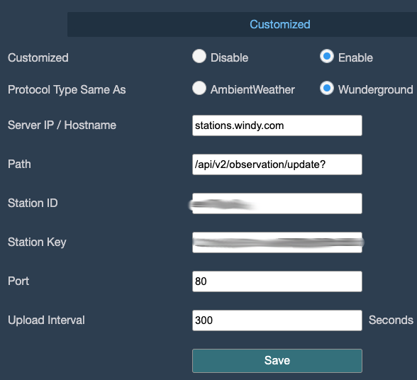

## Prerequisites

- **Set up your Ambient Weather station and connect it to the internet** - follow the user documentation that came with your station.
- **Access the Ambient Weather administration** - the simplest option is to use the AWNET mobile application.

## Steps

The exact configuration options may vary depending on your firmware version.

1. Open the AWNET application and choose your station.
1. Navigate to **Device Settings -> Customized** (or **Customized Server**).
1. Select **Enable**.
1. Fill in the following fields:
   - **Protocol Type**: `Wunderground`
   - **Server / Hostname**: `stations.windy.com` (do not include `http://`, `https://`, or a trailing slash `/`)
   - **Port**: `80` for HTTP, or `443` if your station supports HTTPS
   - **Path**: `/api/v2/observation/update?` (include the final `?` exactly as shown)
   - **Station ID**: enter the _Station id_ of your station
   - **Station Key / Password**: enter the _Station password_ of your station
   - **Upload interval**: `300` means 5 minutes. Do not send data more often than once every 5 minutes; otherwise, your requests will be blocked by the rate limiter. You can use a longer interval if needed.
1. Save your changes by clicking the `Save` button.

You can find your _Station id_ and _Station password_ on the station detail page in Windy Stations: **My Stations -> station -> Connection**.
