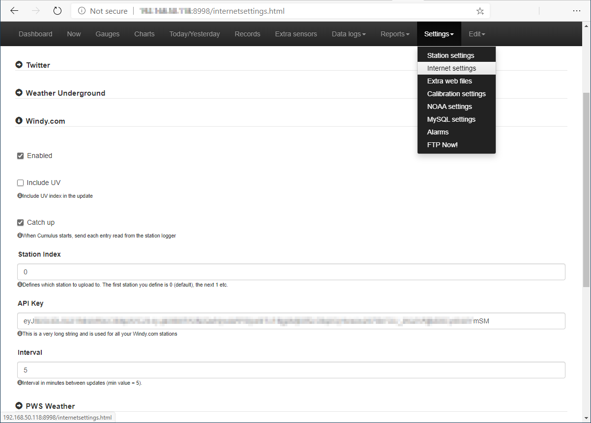

## Prerequisites

- **Cumulus MX connected to the Internet** - your station must be connected to the network with access to the Internet
- **Access Cumulus Admin interface** - it's usually located on `http://ip-address:8998`

## Steps

1. Navigate to **Settings | Internet** settings
   
2. Scroll down to the **Windy.com** entry and click the arrow to expand it.
3. Tick **Enabled**, optionally select Include UV, at this moment will be not displayed on web, but will be saved.
4. The **Catch up** option sends historic data for any gap if Cumulus is shut down and restarted. This is only applicable if you have a station with a data logger.
5. Set the **Station ID**, for most people with one station this will be the default value of zero.
6. Enter the **API key**, be careful to include it whole.
7. Set the **Upload Interval**, this has a minimum value of 5 minutes.
8. Scroll to the bottom of the page and click **Save**.

Author: [TomSlavkovsky](https://community.windy.com/user/tomslavkovsky)
