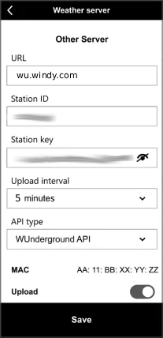

## Prerequisites

- **Set up your Garni station and connect it to the internet** - follow the user documentation that came with your station.
- **Access the Garni administration** - the simplest option is to use the WSLink mobile application (many users find the application very buggy, so please be patient)

## Steps

The exact configuration options may vary depending on your firmware version.

1. Open the WSLink application and choose your station.
1. Navigate to **Device Settings -> Weather server -> Other server**.
1. Fill in the following fields:
   - **URL**: `wu.windy.com` (do not include `http://`, `https://`, a trailing slash `/`, or a path; it must be entered exactly as shown)
   - **Station ID**: enter the _Station id_ of your station
   - **Station key**: enter the _Station password_ of your station
   - **Upload interval**: `5 minutes`. Do not send data more often than once every 5 minutes; otherwise, your requests will be blocked by the rate limiter. You can use a longer interval if needed.
   - **API Type**: `WUnderground API`
   - **Upload**: ensure this checkbox is checked
1. Save your changes by clicking the `Save` button.

You can find your _Station id_ and _Station password_ on the station detail page in Windy Stations: **My Stations -> station -> Connection**.
