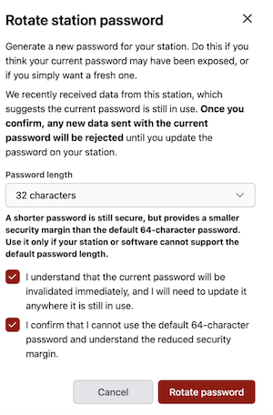
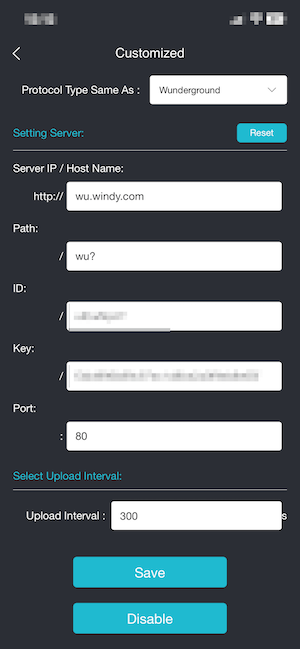

## Prerequisites

- **Set up your GoGEN weather station and connect it to the internet** - follow the user documentation that came with your station.
- **Change the Station Password** - go to [My Stations](https://stations.windy.com/stations) and click your station. On the **Connection** tab, find **Station Password**, click **Change**, and set the password length to 32 characters.

- **Access the GoGEN administration** - the simplest option is to use the Ecowitt mobile application.

## Steps

The exact configuration options may vary depending on your firmware version.

1. Open the Ecowitt application and select your weather station.
1. Navigate to **Device Settings -> Others -> DIY Upload Servers**.
1. Select **Customized**.
1. Set **Customized** to **Enable**.
1. Fill in the following fields:
   - **Protocol Type Same As**: `Wunderground`
   - **Server IP / Hostname**: `wu.windy.com`
   - **Path**: `/wu?` (include the final `?` exactly as shown). If your station does not accept the leading `/`, try `wu?` instead.
   - **Station ID**: enter the _Station id_ of your station.
   - **Station Key**: enter the _Station password_ you changed to 32 characters as described above.
   - **Port**: `80` for HTTP, or `443` if your station supports HTTPS.
   - **Upload Interval**: `300` means 5 minutes. Do not send data more often than once every 5 minutes; otherwise, your requests will be blocked by the rate limiter. You can use a longer interval if needed.
1. Save your changes by clicking the `Save` button.

You can find your _Station id_ and _Station password_ on the station detail page in Windy Stations: **My Stations -> station -> Connection**.

After saving, your station should start sending data automatically. The first update may take a while - in some cases, up to an hour before the station becomes active and starts showing live measurements on <a href="https://windy.com" target="_blank" rel="noopener noreferrer">windy.com</a>.
